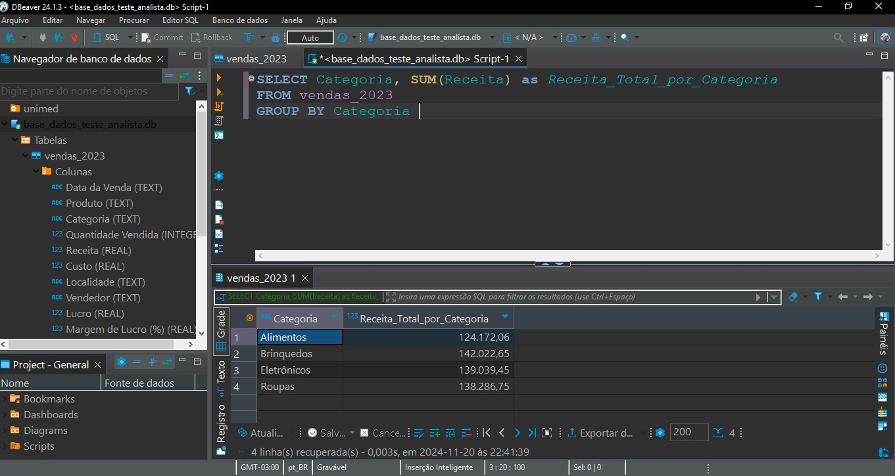

# Unimed Fictional Sales Analysis

This repository contains a dashboard and a predictive sales analysis as part of a case from Unimed Petrópolis job assessment

## Case Goal
The goal is to create an interactive dashboard in Power BI that allows a complete analysis of the sales data provided, as well as performing descriptive and predictive trend analysis. The test also includes creating a simple SQL query
- [dashboard](dashboard_unimed.pbix)

You will receive a CSV file with sales data, containing information such as sale date, product, category, quantity sold, revenue, cost, location and seller.
- [data](base_dados_teste_analista.csv)

## Predictive Analysis
- [predictive analysis](unimed_previsao_vendas_2024(1º trimestre).ipynb)
- [generated file](projecao.xlsx)
  
### Goal:
Using a simple machine learning model, obtain a projection of the sales quantity for the first quarter of the following year (2024), to which the original base refers.

### Methodology:
Two models will be trained to project the next months (Random Forest and Linear Regression). To do this, it will be necessary to:
- 1. Create a variable that differentiates each product.
- 2. Create variables that calculate sales price and unit cost.
- 3. Prepare the data (Encoding) for better algorithm performance.
- 4. Use metrics such as RMSE (root mean square error) to evaluate the performance of these regression models, since we will estimate quantitative values.
- 5. Create a base that simulates sales in the months of January, February and March 2024, with data based on real data.
- 6. Calculate Revenue, cost, profit and margin based on the forecast of quantity sold, price and unit cost and adjustment for inaction reported by the Central Bank for the year 2023
 

## SQL
To be able to use the original file on SQL, the csv file was firstly converted into a sqlite file, and afterwards uploaded on a DBeaver IDE platform. You may find a query example below:

- [converting](https://github.com/joaomacedoDS/unimed_fictional_sales_analysis/blob/master/converte%20_csv_para_sqlite.ipynb)
- [sqlite database](base_dados_teste_analista.db)

